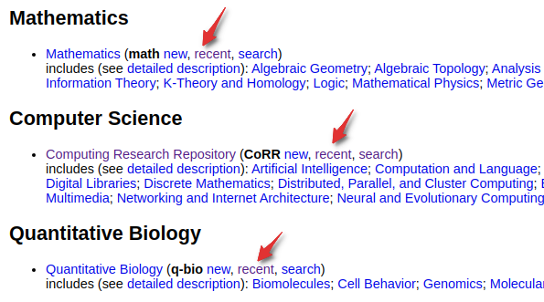
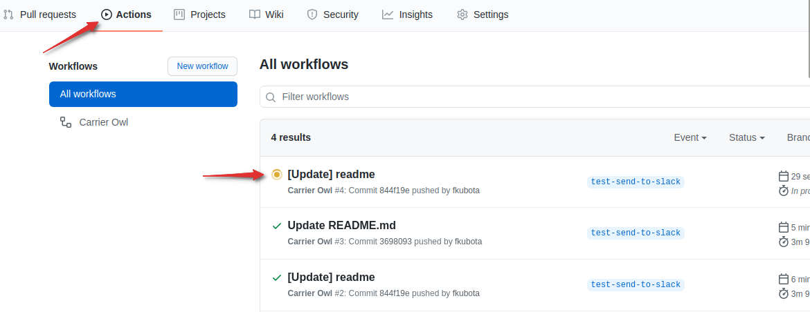

 

# Carrier Owl  


伝書フクロウという意味です。

## About Carrier Owl


前日のarxivから気になる論文にスコアを付けてslackに通知するシステムです。  
通知の際に、abstractをDeepLで翻訳しています。  
**導入に必要なのはgithubアカウントだけです。10minぐらいで設定は終わります！！**  
スコアは、ターゲットとなるキーワードに重み付けをして決まります。(例 resnet=5, kaggle=3, audio=3)    
ユーザーが**好きな領域**、**好きなキーワード**を登録することで、通知される論文は変わります。


- 登録キーワード例
    ```
    keywords:
        sound: 1
        audio: 1
        sound feature: 3
        audio feature: 3
        noise removal: 2
        spectrogram: 3
    ```

- 通知例(score昇順)

    


## Installation

**step**
1. **このリポジトリをフォークする**

2. **GitHub Actionsを有効化する**

    - Actionsタブをクリックし、有効化します。

        

    
3. **webhook urlの取得**
    - 特定のslackチャンネルに流すための準備を行います。
    - incomming webhookの**webhook url**を取得してください。
        - 参考サイト
            - [公式](https://slack.com/intl/ja-jp/help/articles/115005265063-Slack-での-Incoming-Webhook-の利用)
            - [紹介記事](https://qiita.com/vmmhypervisor/items/18c99624a84df8b31008)
    - slack通知の時のアイコンが設定できますので、よければこれ使ってください。
        - [icon](https://github.com/fkubota/Carrier-Owl/blob/master/data/images/carrier-owl.png)
            


4. **webhook urlの設定**
    - step3で取得した `webhook url` を設定します。
    - 手順

        a. `settings` をクリック。

         
        
        b. `Secrets` をクリック。  

        c. `New repository secret` をクリック。

        d. Nameを `SLACK_ID` と入力。Valueを **step2** で取得した`webhook url`を貼り付けます。

        
        
        e. 最後に`Add secret`をクリックして登録完了です。

5. **領域の設定**
    - 通知させたいarxivの論文の領域を指定します。
    - **(computer scienceの人はこの手順を飛ばしてstep8に進んでも構いません)**
    - `computer science` なら `cs` などそれぞれに名前がついています。以下の手順で確認します。
    - 手順
        1. [arxiv.org](https://arxiv.org)にアクセス
        2. 通知させたい領域の**resent**と書かれた部分をクリック。

            
        
        3. 遷移後のページのurlを見て、`list/`と`/recent`に囲われている文字列を使います。

            - computer scienceの例: `https://arxiv.org/list/cs/recent`
            - この場合、`cs` をこの後利用する。
        
        4. `config.yaml` 内の、`subject` を3で取得した文字列に変更します。(デフォルトでは`cs`になっています。)


6. **キーワードの設定**
    - `config.yaml` にキーワードとそのキーワードのスコアを設定します。
    - 例(音に関する論文を通知してほしい場合)
        ```
        keywords:
            sound: 1
            audio: 1
            sound feature: 3
            audio feature: 3
            noise removal: 2
            spectrogram: 3
        ```
    - 仕組みとしては、以下のような感じです。
        1. abstractにキーワードが含まれているか
        2. 含まれていれば、キーワードの合計をscoreとし、昇順で通知

            


7. **通知タイミングの調整**
    - デフォルト設定では、日本時間の平日9時50分に通知されるようになっています。この設定で問題ない方はこれで設定完了です。
    - 通知タイミングのカスタマイズは、[こちら](https://github.com/fkubota/Carrier-Owl/blob/93e83a4ab7a67b127a3be2a2f1059dbed7dadbf0/.github/workflows/cron.yml#L6)を変更することで可能です。

8. **push** 
    - ここまでの変更がmasterブランチに反映されていれば、これですべての設定が完了したことになります。次の通知タイミングでslackに通知されます。

9. **test**
    - 試しに動かしてみたい場合は、`master` ブランチから `test-send-to-slack` ブランチを作成してください。`test-send-to-slack` ブランチが作られるとgithub actionsが走って問題なければ通知されるはずです。
    - Actionsタブで様子を確認できます。

        


## Thanks
- [hppさん](https://github.com/hppRC)のお力をお借りして、v2.0.0から `github` だけで動作するようになりました。ご協力ありがとうございました。
