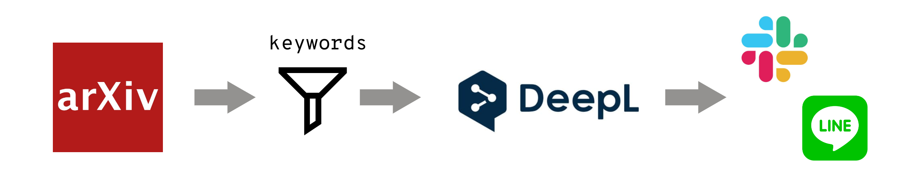

 

# Carrier Owl  


伝書フクロウという意味です。  

不具合などがあればTwitterの [#carrier_owl](https://twitter.com/search?q=#carrier_owl&src=typed_query) で情報共有を行っています。


## About Carrier Owl



2日前のarxivから気になる論文にスコアを付けてslackに通知するシステムです。  
通知の際に、abstractをDeepLで翻訳しています。  
**導入に必要なのはgithubアカウントだけです。10minぐらいで設定は終わります！！**  
スコアは、ターゲットとなるキーワードに重み付けをして決まります。(例 resnet=5, kaggle=3, audio=3)    
ユーザーが**好きな領域**、**好きなキーワード**を登録することで、通知される論文は変わります。  


- 登録キーワード例
    ```
    keywords:
        sound: 1
        audio: 1
        sound feature: 3
        audio feature: 3
        noise removal: 2
        spectrogram: 3
    ```

- 通知例(score昇順)

    


## Installation

**step**
1. **このリポジトリをフォークする**

2. **GitHub Actionsを有効化する**

    - Actionsタブをクリックし、有効化します。

        


3. **通知先の設定**
    通知したいアプリケーションに応じて設定を行います。いくつでも設定可能です。

    - Slackに通知する場合は[こちら](./docs/slack_setup.md)
    - LINEに通知する場合は[こちら](./docs/line_setup.md)


4. **webhook urlの設定**
    - step3で取得した `webhook url`(または `line token`) を設定します。
    - 手順

        a. `settings` をクリック。

         
        
        b. `Secrets` をクリック。  

        c. `New repository secret` をクリック。

        d. Nameを `SLACK_ID`(または `LINE_TOKEN` ) と入力。Valueを **step2** で取得した`webhook url`(また `line token`)を貼り付けます。

        
        
        e. 最後に`Add secret`をクリックして登録完了です。

5. **領域の設定**

    - 通知させたいarxivの論文の領域を指定します。
    - **(computer scienceの人はこの手順を飛ばしてstep8に進んでも構いません)**
    - 手順
        1. 以下の表から通知を受け取りたいsubjectを選択して、urlをクリックしてください。

        | subject                                    | category | url                                       |
        | ------------------------------------------ | -------- | ----------------------------------------- |
        | Astrophysics                               | astro-ph | [url](https://arxiv.org/archive/astro-ph) |
        | Condensed Matter                           | cond-mat | [url](https://arxiv.org/archive/cond-mat) |
        | Physics                                    | physics  | [url](https://arxiv.org/archive/physics)  |
        | Mathematics                                | math     | [url](https://arxiv.org/archive/math)     |
        | Nonlinear Sciences                         | nlin     | [url](https://arxiv.org/archive/nlin)     |
        | Computer Science                           | cs       | [url](https://arxiv.org/archive/cs)       |
        | Quantitative Biology                       | q-bio    | [url](https://arxiv.org/archive/q-bio)    |
        | Quantitative Finance                       | q-fin    | [url](https://arxiv.org/archive/q-fin)    |
        | Statistics                                 | stat     | [url](https://arxiv.org/archive/stat)     |
        | Electrical Engineering and Systems Science | eess     | [url](https://arxiv.org/archive/eess)     |
        | Economics                                  | econ     | [url](https://arxiv.org/archive/econ)     |

        2. さらに細かい分類を確認します
            - 以下の例は、subject = `cs` をクリックした場合です。`cs.AI` や `cs.CL`　などが細かな分類になります。

            

        3. `config.yaml` 内の、`subject` を2で確認した文字列に変更します。
            - デフォルトでは`cat:cs.*`になっています。これは、cs以下の小分類すべてを通知するという設定になります。
            - **複数領域指定**
                - 複数領域指定も可能です。以下のよう `OR` でつなぎます。
                    - ex1) `cat:cs.AI OR cat:cs.CV`
                    - ex2) `cat:physics.* OR cat:cs.*`
                    - ex3) `cat:physics.space-ph OR cat:cs.AI OR cat:q-bio.BM`


6. **キーワードの設定**
    - `config.yaml` にキーワードとそのキーワードのスコアを設定します。
    - 例(音に関する論文を通知してほしい場合)
        ```
        keywords:
            sound: 1
            audio: 1
            sound feature: 3
            audio feature: 3
            noise removal: 2
            spectrogram: 3
        ```
    - 仕組みとしては、以下のような感じです。
        1. abstractにキーワードが含まれているか
        2. 含まれていれば、キーワードの合計をscoreとし、昇順で通知

            


7. **通知タイミングの調整**
    - デフォルト設定では、日本時間の水木金土日の9時50分に通知されるようになっています。二日前のarxivを通知している＆土日にarxivが更新されないという理由からこの設定になっています。この設定で問題ない方はこれで設定完了です。
    - 通知タイミングのカスタマイズは、[こちら](https://github.com/fkubota/Carrier-Owl/blob/93e83a4ab7a67b127a3be2a2f1059dbed7dadbf0/.github/workflows/cron.yml#L6)を変更することで可能です。

8. **push** 
    - ここまでの変更がmasterブランチに反映されていれば、これですべての設定が完了したことになります。次の通知タイミングでslackに通知されます。

9. **test**
    - github actions の `workflow_dispatch` を使って通知タイミングを待たずにいつでも実行することができます。
    - Actionsタブでから、`Run workflow` をクリックすることでいつでも実行可能です。

        

## その他の設定
- **score threshold**
    通知するスコアに閾値を設定することができます。`score >= scrore_threshold` を満たす論文のみ通知させることができま
    す。 `config.yaml` 内の、`score_threshold` で設定できます(デフォルトは0になっています)。


## Thanks
- [hppさん](https://github.com/hppRC)のPRにより、github actionsを使うことにより `github` だけで動作するようになりました。

- [wakamezakeさん](https://github.com/wakamezake)のPRにより、arxiv-apiを導入しました。

- [amagaeruさん](https://github.com/amagaeru1113)のPRにより、LINE通知機能を実装しました。
