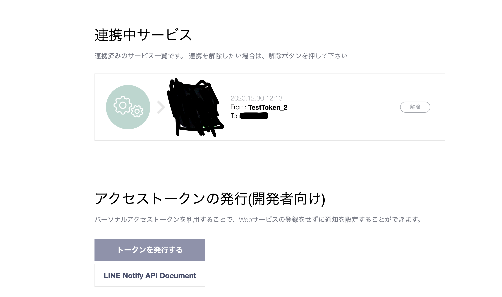

**LINE通知導入手順**

1. LINE Notify(https://notify-bot.line.me/ja/) にアクセスし、ログイン

2. ページ右上にある自分の名前をクリックし、マイページに移動

3. マイページ下部でアクセストークン発行

    - 下記ページで発行

    

    - 発行時、通知するトークルームを設定できるので同じトークルームに入っている複数名に通知可能

